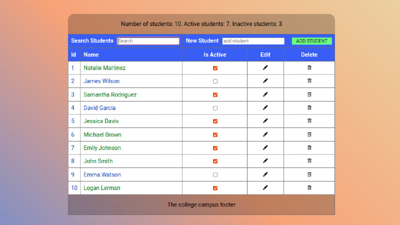

# Showing how to implement feature flags by using both ConfigCat's and LaunchDarkly's solutions

## College campus management system app

This repository contains a demo application called "college campus management system," which allows managing student records. The app's new feature is a new React component named "TableCaption" that adds new functionality to the app. It sums up the types and numbers of students. The feature is toggled on and off using the ConfigCat and LaunchDarkly feature flag services.



## Build & Run

1. Clone this repository to your local machine.
2. Open a terminal and navigate to the root directory of the sample app.
3. Install dependencies by running:

```
npm install.
```

4. To start the development server, run:

```
npm run dev.
```

5. Open your browser and navigate to http://localhost:5173 to see the application running.

## Learn more

- [React](https://beta.reactjs.org/)
- [ConfigCat](https://configcat.com/docs/)

[**ConfigCat**](https://configcat.com) also supports many other frameworks and languages. Check out the full list of supported SDKs [here](https://configcat.com/docs/sdk-reference/overview/).

You can also explore other code samples for various languages, frameworks, and topics here in the [ConfigCat labs](https://github.com/configcat-labs) on GitHub.

Keep up with ConfigCat on [Twitter](https://twitter.com/configcat), [Facebook](https://www.facebook.com/configcat), [LinkedIn](https://www.linkedin.com/company/configcat/), and [GitHub](https://github.com/configcat).

## Author

[Emil Kovacevic](https://github.com/emilkovacevic)

## Contributions

Contributions are welcome!
